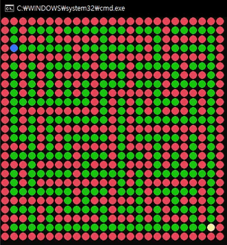
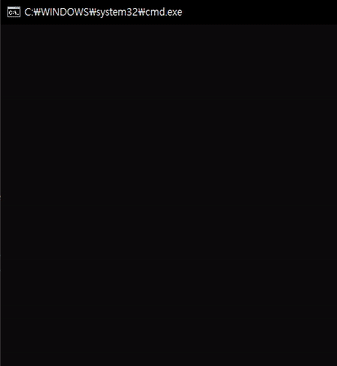

# 🚀CSharp_GameAlgorithm
- C#으로 만드는 게임 관련 알고리즘 공부
- 길찾기, 최단경로에 대한 알고리즘 공부
- MAZE 맵 설계 (미로생성)

　
## 기초 자료구조 학습
- 연결리스트
- 스택
- 큐
- 트리
- 힙(우선순위 큐)
- 그래프

　
## 길찾기
- 우수법(right hand)
- DFS
- BFS
- Dijkstra
- A*

　
## ☑ TODO
- [x] 강의 1회
- [ ] 복습 1회

　
# 🎨 결과물 gif
### 1. 우수법(오른손 법칙)

### 2. BFS

### 3. A*

